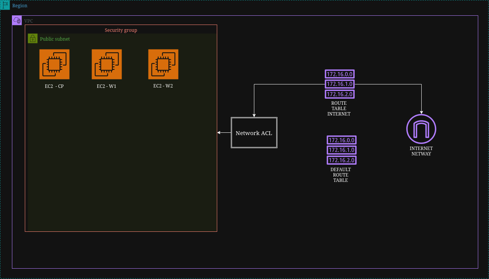

# Infra Terraform — Cluster Kubernetes na AWS

Infraestrutura como código (IaC) com **Terraform** para provisionar, na AWS, a base de rede e as máquinas de um cluster Kubernetes: 1 nó de control plane e 2 nós worker.

## Arquitetura



Todos os recursos ficam na região `us-east-1`, dentro de uma VPC dedicada. As três instâncias EC2 ficam em uma subnet pública, protegidas por um Security Group, e saem para a internet por uma route table associada ao Internet Gateway.

## Recursos criados

| Arquivo | Recurso | Descrição |
|---|---|---|
| `1-vpc.tf` | `aws_vpc.custom_vpc` | Provider AWS (`us-east-1`) e VPC `10.0.0.0/16` |
| `2-subnet.tf` | `aws_subnet.public_subnet` | Subnet pública `10.0.2.0/24` em `us-east-1a`, com IP público automático |
| `3-security-group.tf` | `aws_security_group.sg_custom` | Regras de entrada/saída do cluster (ver tabela abaixo) |
| `4-ig.tf` | `aws_internet_gateway.ig_custom` | Internet Gateway da VPC |
| `5-route-table.tf` | `aws_route_table.aws_route_table_internet` | Rota `0.0.0.0/0` → Internet Gateway |
| `6-route-table-association.tf` | `aws_route_table_association` | Associa a route table à subnet pública |
| `7-ec2-worker.tf` | `aws_instance.ec2-control`, `ec2-worker1`, `ec2-worker2` | 3 instâncias `c7i-flex.large` (1 control plane + 2 workers) |
| `8-data.tf` | `data.http.my_ip` / `local.my_ip_cidr` | Descobre seu IP público via `api.ipify.org` e gera o CIDR `/32` |
| `9-variables.tf` | `var.my_ip` | Variável com o seu IP |

### Regras do Security Group

| Porta | Protocolo | Origem | Uso |
|---|---|---|---|
| 22 | TCP | Seu IP (`/32`) | SSH |
| 80 | TCP | `0.0.0.0/0` | HTTP |
| 6443 | TCP | Seu IP (`/32`) | Kubernetes API Server |
| 2379 | TCP | O próprio Security Group | etcd (comunicação interna do cluster) |
| Todas | Todos | `0.0.0.0/0` | Saída (egress) liberada |

## Pré-requisitos

- [Terraform](https://developer.hashicorp.com/terraform/install) instalado
- Conta AWS com credenciais configuradas (`aws configure` ou variáveis de ambiente)
- Um key pair chamado `sua .pem` existente em `us-east-1` (ou altere `key_name` em `7-ec2-worker.tf`)

## Como usar

```bash
# Inicializa o diretório e baixa os providers (aws, http)
terraform init

# Mostra o plano de execução
terraform plan

# Cria a infraestrutura
terraform apply

# Remove toda a infraestrutura
terraform destroy
```

> A variável `my_ip` é obrigatória e será pedida no `plan`/`apply`. Você pode passá-la com `-var="my_ip=SEU_IP"` ou em um arquivo `terraform.tfvars` (já ignorado pelo `.gitignore`).

Depois do `apply`, acesse as instâncias via SSH:

```bash
ssh -i <sua .pem> ubuntu@<IP_PUBLICO_DA_INSTANCIA>
```

> O usuário SSH depende da AMI utilizada (`ubuntu` para Ubuntu, `ec2-user` para Amazon Linux).

## Estrutura do projeto

```
.
├── 1-vpc.tf
├── 2-subnet.tf
├── 3-security-group.tf
├── 4-ig.tf
├── 5-route-table.tf
├── 6-route-table-association.tf
├── 7-ec2-worker.tf
├── 8-data.tf
├── 9-variables.tf
├── image/
│   └── terraform-diagram.jpg
└── README.md
```
